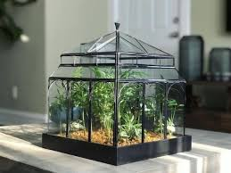

# Terrarium-2023b

## Descripción
Proyecto de la clase de programación web orientado
a practicar las bases del código HTML + CSS + JS 💖

## Autor

Eduardo Suárez

## 📝 Notas de clase

1. HTML 
2. CSS
3. Javascript